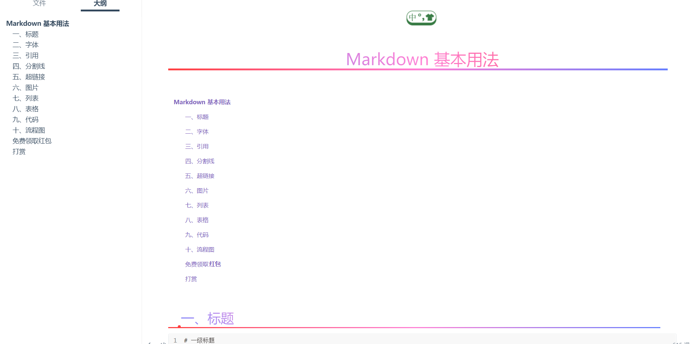
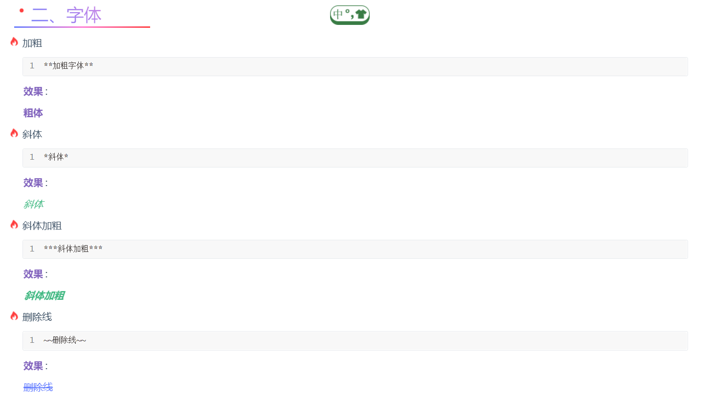
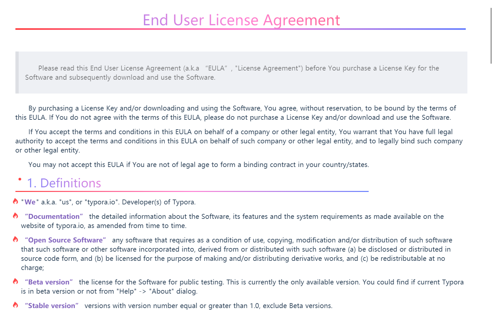

# Typora-colour-theme

> 致力打造一个最受欢迎的Typora主题

## 样例

**注** *更多有趣的，等待着您去发现，欢迎下载使用*

## 安装步骤

+ `文件→偏好设置→外观→打开主题文件夹`
+ 下载`colour.css`到`主题文件夹`
+ 重新运行`Typora`即可

**说明** *支持六级无序列表和有序列表*

**注** *`colour.min.css`可用于网页Typora主题*

## 免费得红包

## 打赏

如果您觉得有用，请打赏作者，鼓励一下~~~`一分也是爱`

+ 
+ 

